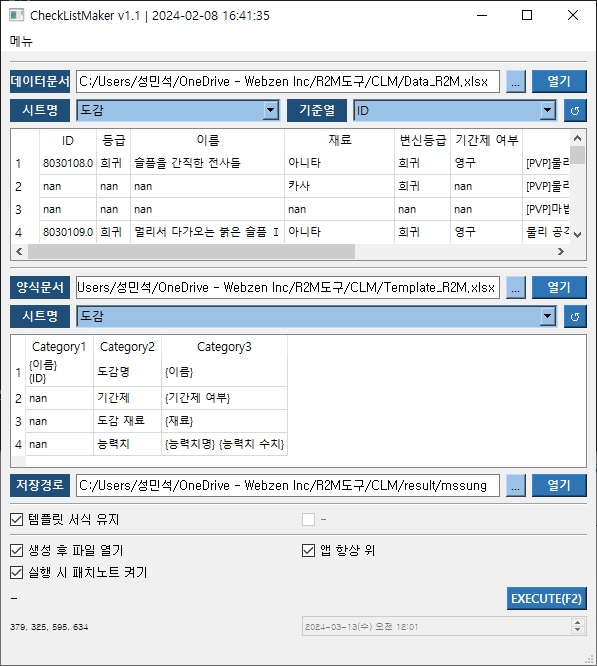

## 범용 체크리스트 자동화 툴 프로젝트



### 목차

1. [**소개**](#1-소개)
2. [**설치**](#2-설치)
3. [**사용법**](#3-사용법)
4. [**기능**](#4-기능)

---

### 1. 소개

1. **테스트 케이스 자동 생성 기능 개발**

    ```bash
    라이브 서비스 장애 분석을 통해 자동화 우선순위 대상 선정
    로그 자동 수집 및 빌드와 배포 자동화를 통한 신속한 유지 보수
    Pyqt5 GUI 개발로 툴 사용 접근성 강화
    체크리스트/테스트 케이스 구분 생성 기능 개발
    ```

2. **테스트 케이스 설계 및 관리 기능 개발**

    ```bash
    프로젝트 내 일관된 테스트 케이스 관리 환경 구축 및 개발
    프로젝트 내 명세서 히스토리 관리 환경 구축 및 개발
    ```

---

### 2. 설치

1. **공통**:

    ```bash
    # 프로젝트 클론
    git clone https://github.com/SungMinseok/Checklist_Maker
    ```
    
    ```bash
    # 가상환경 생성 (python == 3.9.4)
    python -m venv CLM
    ```
2. **외부망**:
    ```bash
    # 의존성 설치
    cd CLM
    pip install -r requirements.txt
    ```
    

---

### 3. 사용법

1. **개발PC**:

    ```bash
    python Execute.py
    ```

2. **원본PC**:

    ```bash
    python CLM.py
    ```

---

### 4. 기능

1. **사용자 임의 양식 유지**:

    ```bash
    모든 데이터에 대해 사용자 임의 양식대로 문서 생성 자동화 기능
    ```

2. **데이터/템플릿 관리 기능**:

    ```bash
    데이터 및 템플릿 히스토리 관리 기능
    ```